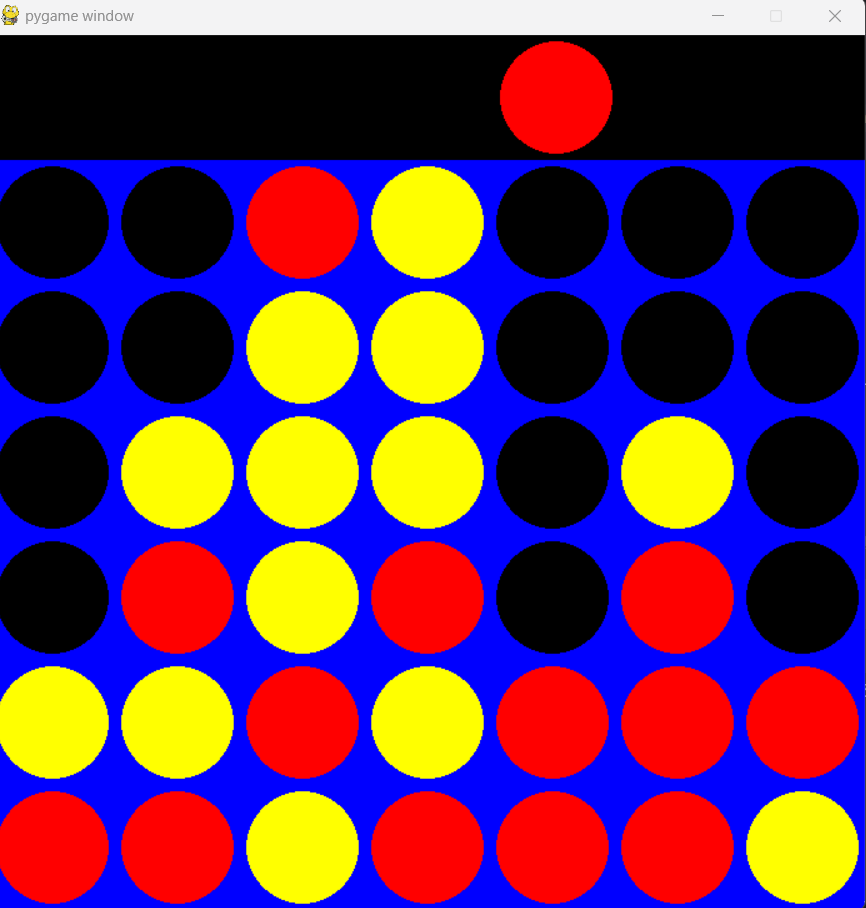
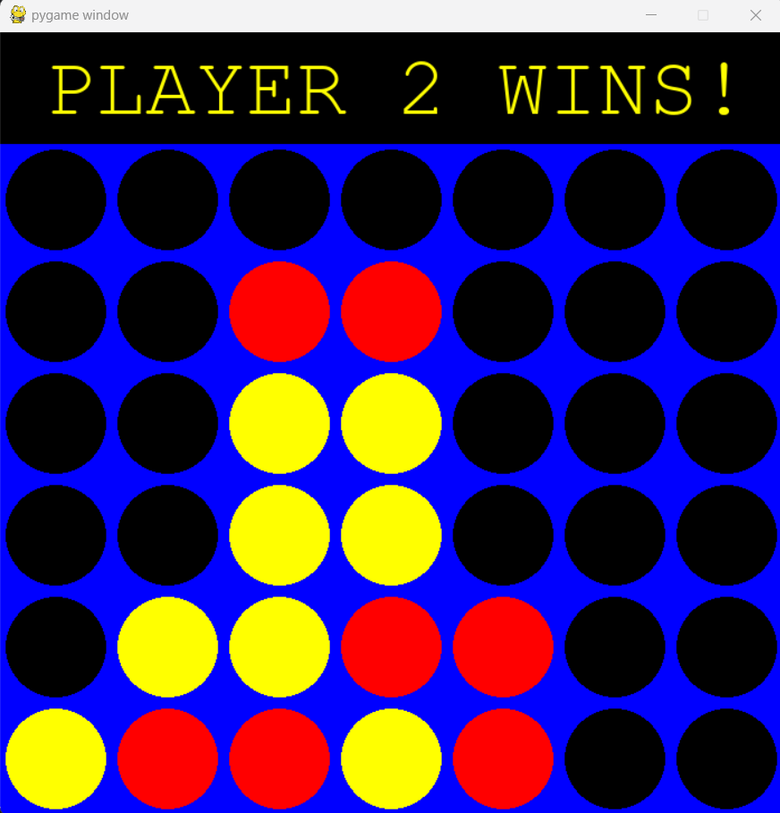

# Connect Four AI 🎮🧐

  

## About the Project  
This is an AI-powered version of the classic Connect Four game implemented using the Minimax algorithm. It was developed as part of the **Artificial Intelligence Principles and Applications** course at the **University of Isfahan**.

---

## Features 🌟  
- **Minimax Algorithm**: Implemented to make optimal decisions during the game.  
- **Graphical Interface**: Designed using Pygame for an interactive experience.  
- **Dynamic Scoring**: Customizable scoring system to enhance gameplay.  
- **Smart Moves**: The AI no longer makes random moves but calculates the best ones.

  

## How the Minimax Algorithm Works 🧠  
The Minimax algorithm evaluates possible game states up to a certain depth and selects the optimal move for the computer player.  

---

## Implemented Features ✅  
- Full implementation of the **Minimax algorithm**  
- Enhanced graphical interface for better user experience  

